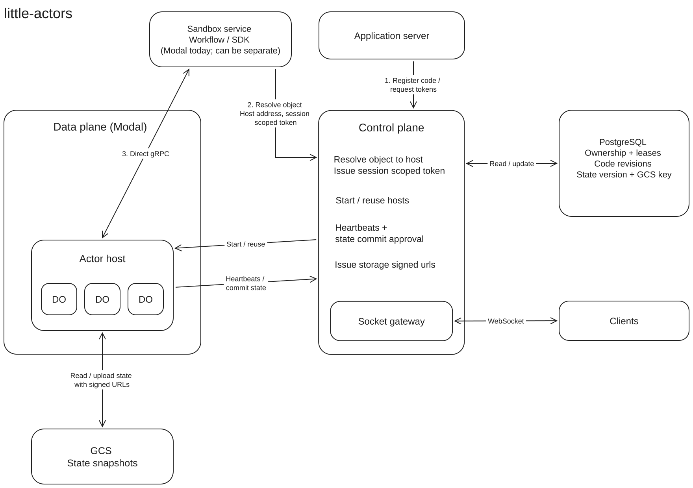

# little-actors

little-actors is a lightweight framework for durable actors, powered by Rust.

Durable Actors are TypeScript classes that preserve their own state.

## Define an Actor

```ts
import { Actor, Emittable, Persisted } from "little-actors"
import type { ActorSocket } from "little-actors"

export class ChatRoom extends Actor<Member, ClientEvent, never> {
    @Persisted @Emittable history: ChatMessage[] = []

    async onMessage(socket: ActorSocket<Member, never>, message: ClientEvent): Promise<void> {
        this.history.push({ name: socket.metadata.name, text: message.text })
    }
}

type Member = { name: string }
type ClientEvent = { type: "post"; text: string }
type ChatMessage = { name: string; text: string }
```

## Complete Tutorial - Chat App with Actors +

```sh
npx little-actors init chat-example && cd chat-example
npm install
npx little-actors generate
npx little-actors dev
```

The last command stats a web server, wait for `Local actors ready at http://127.0.0.1:7100`

The native runtime downloads automatically. Wait for `Local actors ready at http://127.0.0.1:7100`.

In another terminal, run the web app from `chat-example`:

```sh
npm run dev
```

Open **[http://127.0.0.1:3000](http://127.0.0.1:3000)** and choose a name. Open a private window to chat with a second user.

## Host it yourself

Follow the [self-hosting guide](docs/guides/self-hosting.md) to connect your backend with an API key and deploy your actors.

## Reference

- [CLI reference](docs/reference/cli.md): running actors, generating SDKs, command options, and environment variables.
- [TypeScript API reference](docs/reference/api.md): actor classes, methods, connections, types, and errors.
- [HTTP and WebSocket reference](docs/reference/http.md): deployments, backend access, WebSockets, and callbacks.
- [Advanced access configuration](docs/guides/advanced-access.md).



## License

MIT © 2026 Terse
