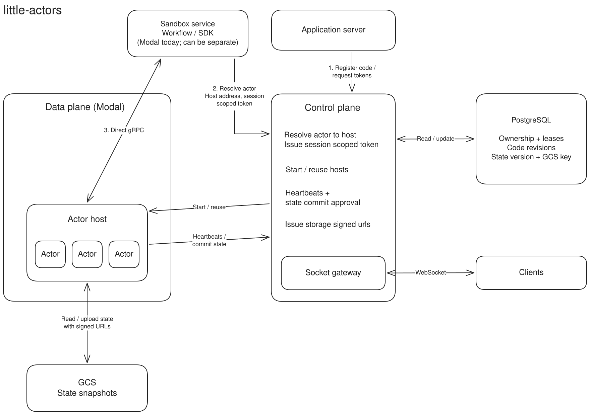

# little-actors

Coordinating state across machines adds latency. Traditional solutions such as [two-phase commit (2PC)](https://arxiv.org/abs/cs/0408036) and [Paxos](https://lamport.azurewebsites.net/pubs/paxos-simple.pdf) introduce a lot of overhead. Actors simplify application updates by giving each piece of state one owner.

## Build a chat room in your terminal

This tutorial will introduce you to creating Actors with little-actors by creating a chat room in your terminal.

Requires **Node.js 20+ and npm**. The CLI downloads the runtime, with SQLite included. No Rust installation or runtime path is needed.

### 1. Create a project

```sh
mkdir -p chat-example/src && cd chat-example
npm init -y && npm pkg set type=module
npm install little-actors
```

### 2. Create the room

Create `src/actors.ts`:

```ts
import { Actor } from "little-actors"
import type { ActorSocket } from "little-actors"

export class ChatRoom extends Actor {
    history: string[] = []

    async onMessage(_socket: ActorSocket, message: string | Uint8Array): Promise<void> {
        if (typeof message !== "string") return
        this.history.push(message)
        this.broadcast(message)
    }
}
```

`history` is saved actor state. Each incoming message appends to it and broadcasts to everyone in the room, including the sender. When a client connects, the runtime automatically sends the saved state, including the full history.

### 3. Create the terminal client

Create `src/chat.ts`:

```ts
import { createInterface as readLines } from "node:readline"

import { ChatRoom } from "./actors.js"

const name = process.argv[2] ?? "Anonymous"
const socket = await ChatRoom.get("lobby").connect({})
const terminal = readLines({ input: process.stdin, output: process.stdout })

socket.addEventListener("message", ({ data }) => console.log(String(data)))
socket.addEventListener("close", () => terminal.close())

for await (const line of terminal) {
    socket.send(`${name}: ${line}`)
}
socket.close()
```

Both clients use `ChatRoom.get("lobby")`, so they share one actor. A different room name creates a separate conversation with its own history.

### 4. Start the server

In terminal 1, from the project directory:

```sh
npx lac dev
```

Leave this running. It starts the local server and registers your actor file. SQLite metadata and snapshots go in `.little-actors/`.

Wait for this line before connecting:

```text
Local actors ready at http://127.0.0.1:7100
```

### 5. Open two listeners and chat

In terminal 2, from the same project directory, join as Alice:

```sh
npx lac run src/chat.ts Alice
```

In terminal 3, join as Bob:

```sh
npx lac run src/chat.ts Bob
```

`run` supplies local credentials automatically. Wait for both clients to print the initial state:

```json
{ "type": "state", "state": { "history": [] } }
```

Leave both running: each listens for messages and lets you send your own. The client prints incoming data directly, so saved history appears as JSON and live messages appear as text.

Once both have joined, type `Hello, Bob!` in Alice's terminal and press Enter. Then type `Hey, Alice!` in Bob's terminal and press Enter. Both clients receive:

```text
Alice: Hello, Bob!
Bob: Hey, Alice!
```

### 6. See history after you close your terminal

Press Ctrl-C in Bob's terminal, then run his command again:

```sh
npx lac run src/chat.ts Bob
```

Before Bob types anything, his client shows the saved conversation:

```json
{ "type": "state", "state": { "history": ["Alice: Hello, Bob!", "Bob: Hey, Alice!"] } }
```

To try a full restart, stop both clients and the server with Ctrl-C. Start the server again in terminal 1:

```sh
npx lac dev
```

Wait for the ready line, then rerun Alice's and Bob's commands. Both receive the same history and can keep chatting. The messages live in `.little-actors/`, so keep that directory between runs.

## Host it yourself

Follow the [self-hosting guide](docs/guides/self-hosting.md) for configuration and deployment.

## Reference

- [CLI reference](docs/reference/cli.md): running actors and clients, command options, and environment variables.
- [TypeScript API reference](docs/reference/api.md): actor classes, methods, connections, types, and errors.
- [HTTP and WebSocket reference](docs/reference/http.md): deployments, session tokens, direct connections, and callbacks.



## License

MIT © 2026 Terse
